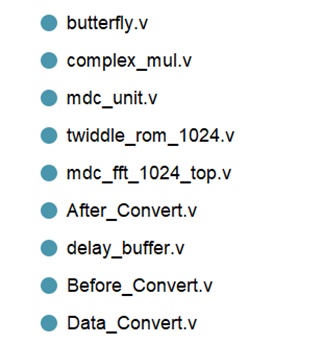
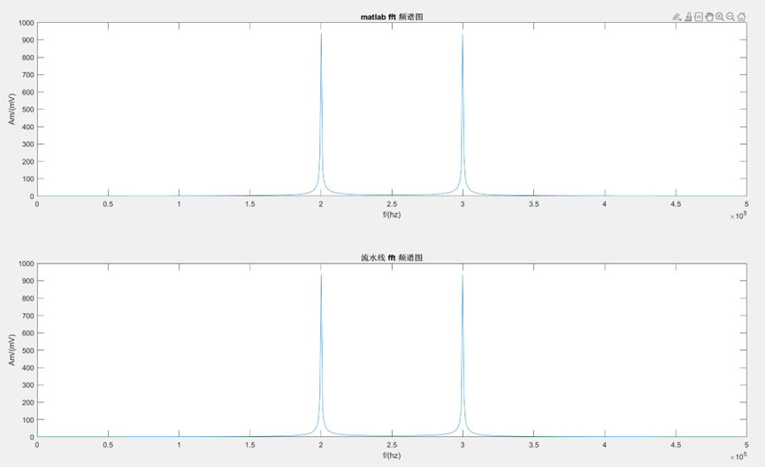
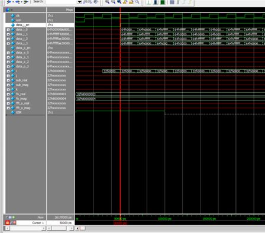

### 基于FPGA的FFT算法并行优化

源代码路径  R4_MDC/1_SourceCode/vivado2018.3_prj/SDF_FFT_1024.srcs/sources_1/new

使用Xilinx Zyqn7000系列开发板，并结合ModelSim与Matlab进行软件仿真，采用四级流水线，在FPGA中部署基4DIF MDC算法，完成对快速傅里叶变换的并行优化。

### Verilog代码框架

### 结果

采用$$
x=\cos \!\:(2\pi \times 200\mathrm{ }t)+\cos \!\:(2\pi \times 300\mathrm{ }t)
$$作为输入，matlab中设置采样率为1MHz，得到采样点数1024的数据，经过仿真测试，信噪比为70.9286，仿真波形如下图所示

### ModelSim仿真

